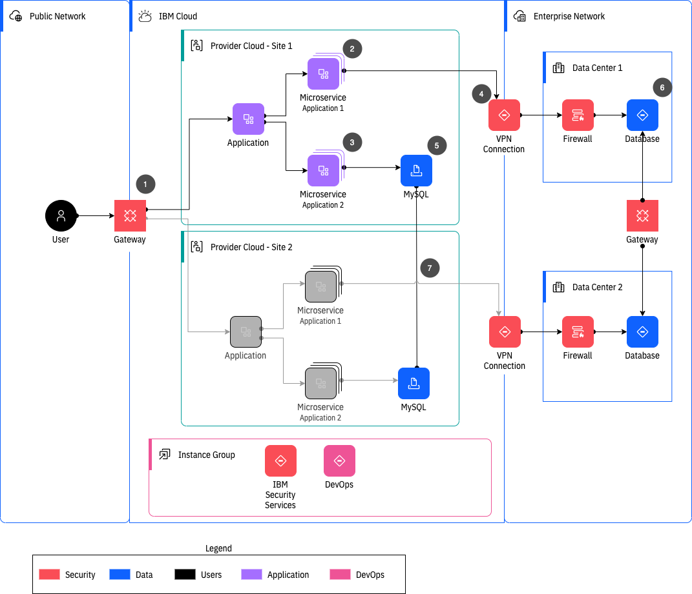
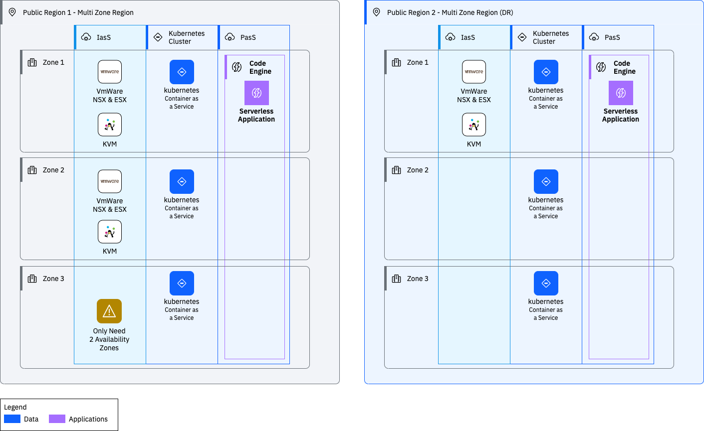
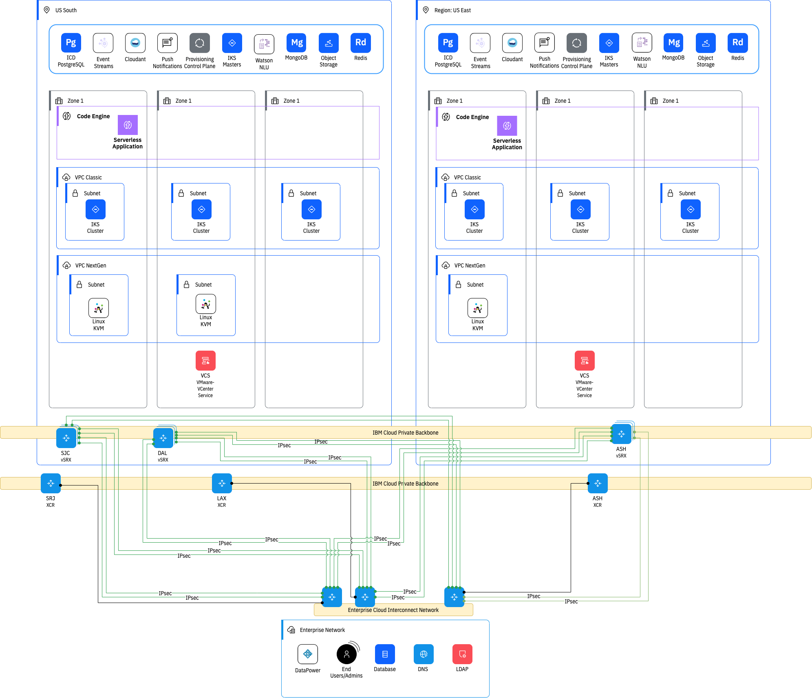
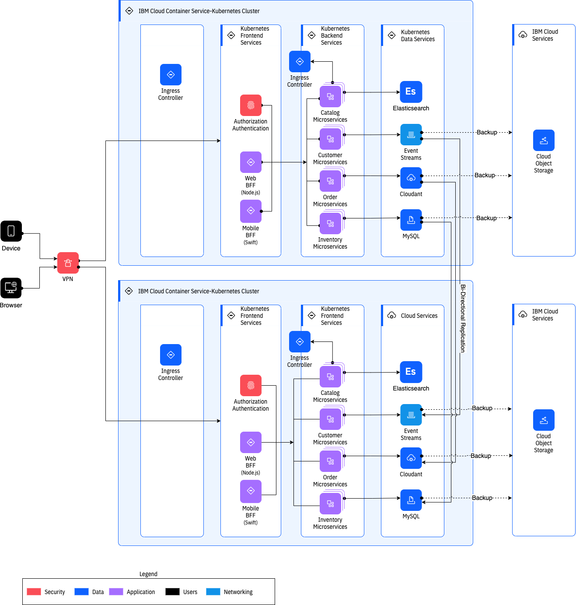
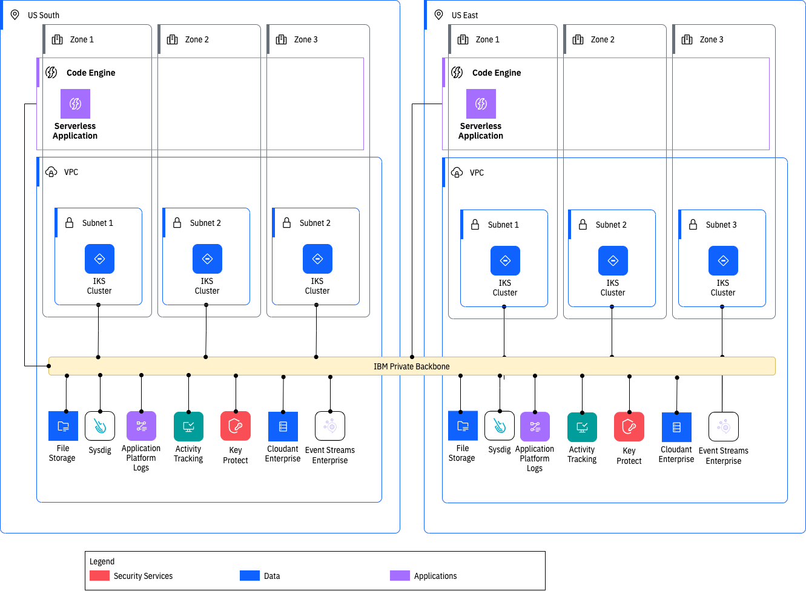
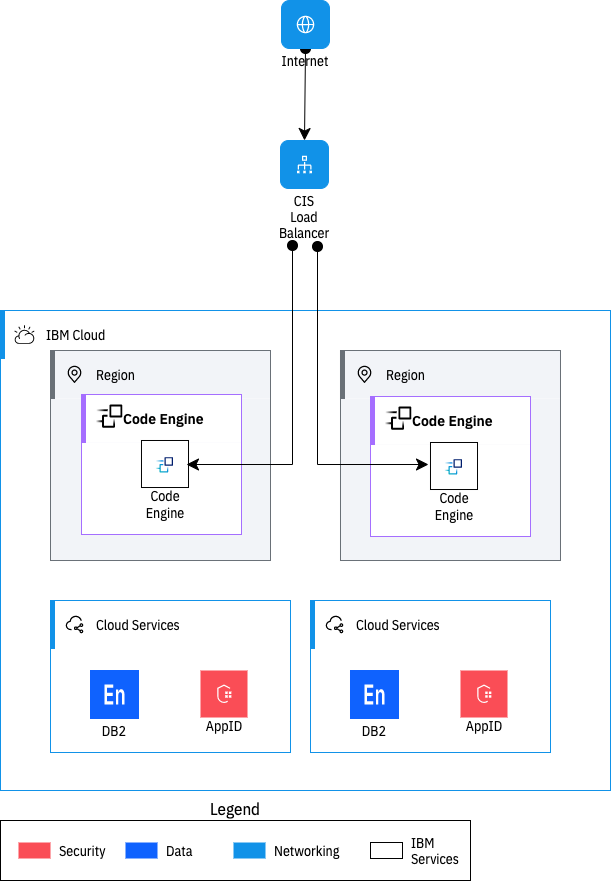
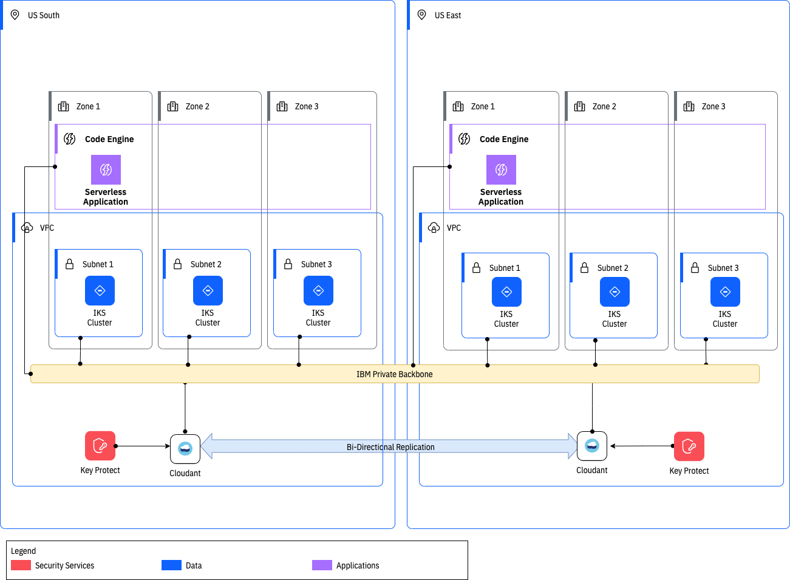
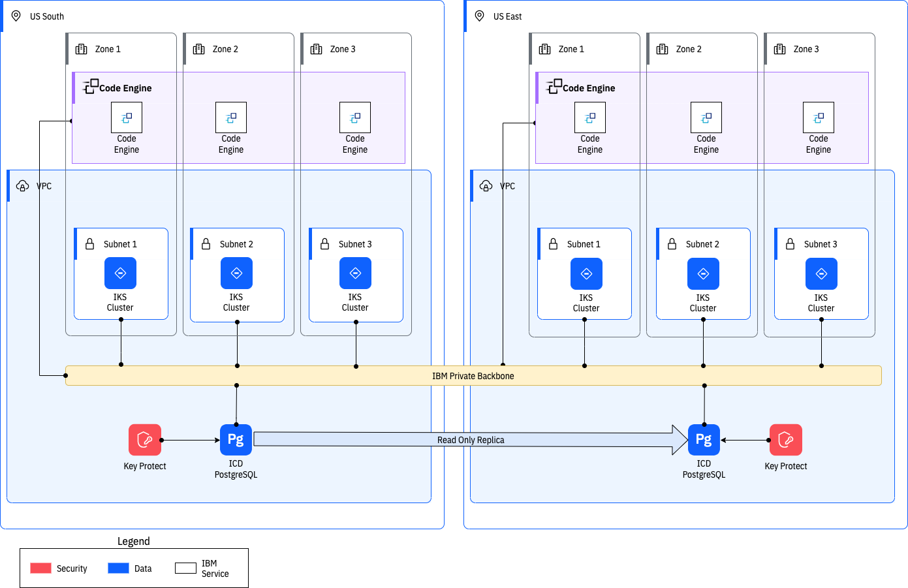
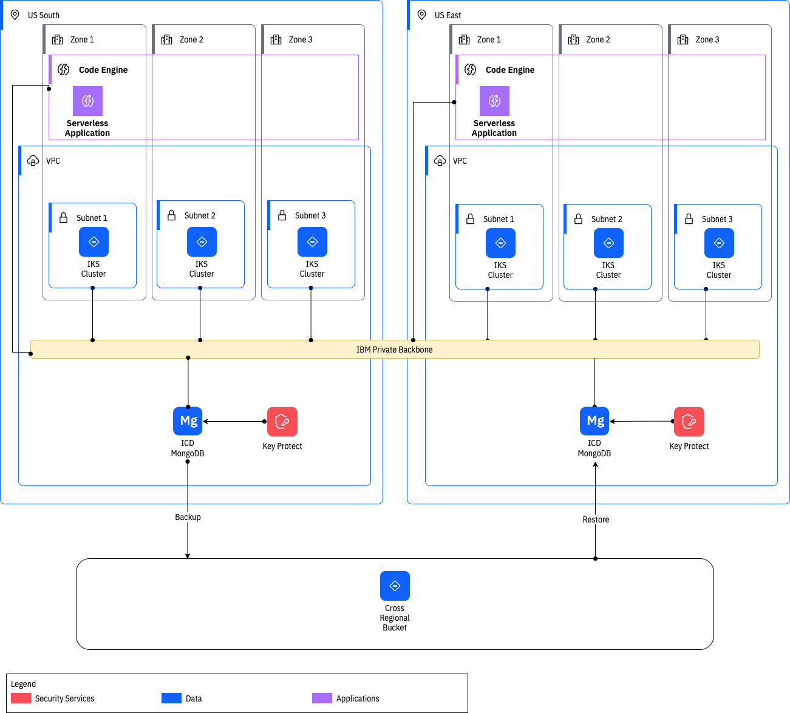
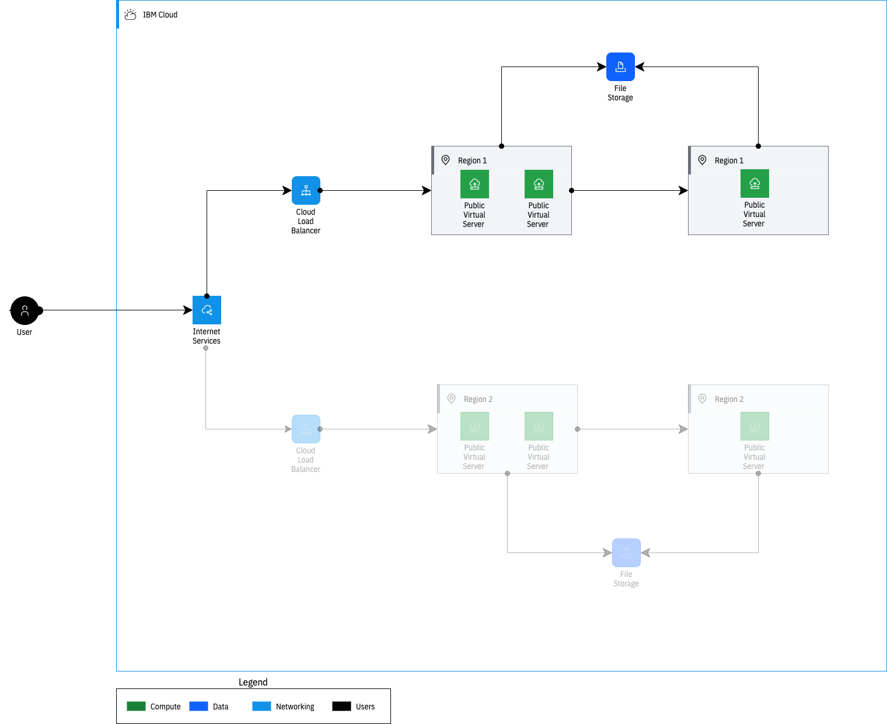

---

copyright:
  years: 2021
lastupdated: "2021-11-17"

keywords: disaster recovery plan, DR, resilient app, plan for DR, DR objectives

subcollection: overview

---

{{site.data.keyword.attribute-definition-list}}

# Designing an architecture for your application resiliency objectives
{: #bcdr-app-recovery}

It is important to ensure that you're meeting your defined recovery (DR) objectives and the DR metric thresholds for your application. Review the following sample application architecture examples to understand how you can meet your recovery objectives by using {{site.data.keyword.cloud}}.
{: shortdesc}

The resiliency options, proposed profiles, and associated information are presented so that you can define your application's DR requirement levels. Information that is stated is not a warranty and {{site.data.keyword.IBM}} will not issue credits for failure to meet an objective. These [recovery time objective](#x3167918){: term} (RTO) and [recovery point objective](#x3429911){: term} (RPO) examples are presented as a reference for additional steps that can be taken to achieve different levels of resiliency. Refer to the Service Level Agreements (SLAs) for any commitments and credits that are issued upon failure to meet any committed SLAs. For more information about the recovery strategy classes, see [Planning your applications recovery strategy objectives](/docs/overview?topic=overview-understanding-dr#planning-your-applications-recovery-strategy-objectives).

## Hybrid disaster recovery: Microservices
{: #bcdr-hybrid}

Business continuity is a top priority for modern applications. The following example shows patterns and best practices to implement DR for hybrid microservice applications in an active/passive configuration.

{: caption="Figure 1. An architecture diagram for disaster recovery for hybrid microservice applications" caption-side="bottom"}

Some of the significant challenges that are unique to the hybrid DR microservices implementation architecture include the following:

Business continuity
:   Business processes can continue to be processed despite man-made or natural disasters.

Operational flexibility
:   Having a well-designed solution with code and data in multiple sites allows for flexibility for where applications and data are deployed based on user need and traffic.

Cost reduction
:   By placing a DR site in the cloud, not all of the resources need to be always running. This results in cost savings compared to a cold standby at an on premises site.

Review the following functional requirements:

- Support for both SQL and NoSQL databases
- Failover and fallback of the whole application stack must be completely automated, or it must be activated by humans with a single action
- Monitor availability of both primary and backup hosting services
- Alert in case of failures

## Cloud architecture based on two multizone regions (MZRs)
{: #bcdr-mzr}

To design a resilient architecture, you need to consider the individual blocks of your solution and their specific capabilities.

{: caption="Figure 2. An architecture diagram for Cloud architecture with two multizone regions" caption-side="bottom"}

In this example, three different infrastructure solutions are used across two MZRs. To achieve the goal of having a resilient architecture, the required deployment footprint differs between IaaS solutions like VMware and Kernel-based virtual machine (KVM) and Kubernetes ({{site.data.keyword.containershort}} and {{site.data.keyword.openshiftlong_notm}}) versus a fully-managed serverless service like {{site.data.keyword.codeengineshort}}.

## Network architecture
{: #bcdr-network}

Review the following network architecture assumptions:

1. As a baseline, the current architecture and procedures being used today in a dedicated deployment also work in public isolated. This might not be the preferred architecture, but it should be used as a starting point. Public cloud offers more flexibility, agility, and customer control that might allow for changes from current procedures to save money, reduce effort, or provide other benefits than are available today with a dedicated cloud.
2. Users of the applications will not see any difference in their usage of the application, whether it's running in dedicated or public locations.
3. Administrators will manually decide when a failover occurs and trigger it manually.
4. All networking is preconfigured in both sites before any sort of disaster declaration.
    - VPC subnets in all locations will have nonoverlapping CIDR blocks.
    - Routes for CIDR blocks in one multizone region (MZR) are advertised to the other ones such that no routing changes are required in a disaster situation.
5. Provisioning of {{site.data.keyword.messagehub}} Enterprise, {{site.data.keyword.cloudant}}, and other services that use dedicated hardware will need to be preprovisioned, as they might take human intervention and several days to provision. {{site.data.keyword.messagehub}} might have automated provisioning on Enterprise Plan, but {{site.data.keyword.cloudant}} is manual per the {{site.data.keyword.cloudant}} documentation.
6. When applications deploy to production, they get deployed to both US South and US East regions, and deployment validation testing is performed in dark mode (in the backup MZR). The testing can be just enough to validate that the app is ready should it be necessary to fail over.
7. There is currently no feature set in {{site.data.keyword.codeenginefull_notm}} to replicate the configuration of one project to another one in a different region. Therefore, the customer team needs to ensure that all necessary configuration changes to the {{site.data.keyword.codeenginefull_notm}} projects in all the regions are enforced.

{: caption="Figure 3. An architecture diagram for network architecture" caption-side="bottom"}

Something to consider in hybrid architecture is the flow of traffic to the public internet. If there are no public VLANs or other direct connectivity to the public internet from {{site.data.keyword.cloud_notm}}, all traffic to and from {{site.data.keyword.cloud_notm}} to the public internet gets routed through your on premises network. 

Therefore, any workload running in the US East region must traverse the {{site.data.keyword.IBM_notm}} private network all the way from Washington DC to the west coast. In many instances, there might be multiple trips that are needed to complete requests to on premises systems. Latency is a factor that should be considered to achieve true active/active workload between US South and US East regions in this model.

## Application profiles
{: #bcdr-sample-app-profiles}

One approach is to build a set of architecture profiles that represent most apps. These profiles include options for various classes of service, compute requirements, and all the other components that are listed.

{: caption="Figure 4. An architecture diagram showing a sample application architecture" caption-side="bottom"}

### Continuous availability profile
{: #bcdr-sample-app-continuous-availability}

The [continuous availability recovery class](/docs/overview?topic=overview-understanding-dr#plan-objectives) can be defined as one for applications that requires the platform to be available in less than an hour in the event of a disaster where the primary MZR becomes unavailable.

#### Continuous availability profile - Compute
{: #bcdr-sample-app-continous-availability-compute}

{: caption="Figure 5. Continuous availability compute architecture" caption-side="bottom"}

In order to meet continuous availability RTO/RPO goals, these components will need to be preconfigured and at their production workload capacity.

The size of the {{site.data.keyword.containershort}} clusters in US East might need to be only large enough to support continuous availability and advanced recovery class workloads. All applications can always be deployed there (as they are today in Dedicated), but for standard recovery and no-recovery class applications they could be stopped. The idea would be to allow for higher availability requirement apps to immediately become available with enough capacity to run them if a failure occurs. But to save money, the cluster would be scaled up to match only the primary cluster and support the lower requirement workloads when needed. These apps have longer RTO in which the scaling operation would complete.

The same technique can be applied to updates to the {{site.data.keyword.codeengineshort}} applications or {{site.data.keyword.containershort}} clusters. The first step would be to scale up the backup cluster to full capacity, matching the primary cluster, before starting the upgrade. Then, do some sort of blue/green update where workload can be switched to the backup while the primary cluster is upgraded. After the primary cluster is upgraded and verified, the workload would be switched back, the backup cluster could be scaled back down, and then upgraded.

How does the failover happen? For example, using {{site.data.keyword.codeengineshort}}:

There are two {{site.data.keyword.codeengineshort}} projects that are provisioned, one in US South (primary MZR) and the other in US East (backup MZR). During normal operation, all traffic is routed to the project in US South. To manage traffic between the two MZRs, follow the [{{site.data.keyword.codeengineshort}} instructions](/docs/codeengine?topic=codeengine-deploy-multiple-regions).

{: caption="Figure 6. An architecture diagram showing a {{site.data.keyword.codeengineshort}} example application architecture" caption-side="bottom"}

Any configuration that is mentioned on the {{site.data.keyword.codeengineshort}} project is performed on both projects to maintain consistency between the primary and backup instances.
{. note}

In the event that a failover needs to be triggered, these are the basic steps to follow.

1. Make sure that the app is deployed in {{site.data.keyword.codeengineshort}} in the backup MZR.
2. Make sure that any data that is needed by the app is available in the backup MZR. This could be accomplished in different ways, depending on the service. {{site.data.keyword.cloudant}} has bidirectional replication, {{site.data.keyword.postgresql}} uses read-only replicas that can be promoted to be leaders, {{site.data.keyword.mongodb}} and {{site.data.keyword.redis}} rely on backup and restore procedures.
3. If necessary, scale up the application in the backup MZR to handle the expected load.
4. When the data is ready and the {{site.data.keyword.codeengineshort}} application is appropriately scaled, start the application.
5. Update the DNS CNAME record to point to the {{site.data.keyword.codeengineshort}} application endpoint of the {{site.data.keyword.codeengineshort}} application in the backup MZR.

#### Continuous availability profile application - {{site.data.keyword.cloudant}}
{: #bcdr-cloudant}

{: caption="Figure 7. {{site.data.keyword.cloudant}} example application architecture" caption-side="bottom"}

In this scenario, {{site.data.keyword.cloudant}} will replicate the data automatically. In the event of a disaster, the only change that is needed will be to reconfigure DNS to point to the cluster in US East.

Benefits
:   Fastest recovery time, dependent only on the time it takes to verify that the data was replicated and make the DNS switch.

Impacts
:   Cost. To support the RTO, the only viable option is the active/hot-standby model.
:   Development teams need to update their deployment pipelines to also deploy their apps to the standby {{site.data.keyword.codeenginefull_notm}} project every time they deploy to production. And, validate that it was successful.

#### Continuous Availability profile application - {{site.data.keyword.postgresql}}
{: #bcdr-postgresql}

{: caption="Figure 8. {{site.data.keyword.postgresql}} example application architecture" caption-side="bottom"}

In this scenario, the data is replicated automatically by {{site.data.keyword.cloud_notm}} Databases to a read-only replica in the backup MZR. In the event of a disaster, the application team needs to manually trigger a promotion of the read-only replica to become the leader. This action will take some time as a read-only replica of the service instance is not configured using a high availability (HA) topology. When the promotion occurs, several steps happen to elevate the instance to an HA configuration.

The only other change that is needed is to reconfigure DNS to point to the cluster in US East when the database promotion is complete.

Benefits
:   Faster recovery time, as the data is already replicated to the backup MZR. There is still some latency related to the time it takes to reconfigure the database to an HA configuration.

Impacts
:   Cost. To support the recovery time objective the only viable option is the active/hot standby model.
:   Development teams need to update their deployment pipelines to also deploy their apps to the standby {{site.data.keyword.codeenginefull_notm}} project every time they deploy to production. And, validate that it was successful.
:   Manual intervention is required to trigger and monitor the promotion of the read-only replica to leader status.

For more details, see [Configuring read-only replicas](/docs/databases-for-postgresql?topic=databases-for-postgresql-read-only-replicas).

**Basic Steps:**

1. Create instance in primary MZR (for example, Dallas)
2. Create read-only replica in DR MZR (for example, Washington, DC)
    Read-only replica is a single zone instance
3. If primary MZR is unavailable, promote read-only replica to leader. Now, DR MZR becomes the leader.
    - This updates the config in the DR MZR to be MZR resilient, meaning additional nodes are added.
    - This takes a full backup of the database in the DR MZR
    - DR MZR becomes the leader, and ties to original leader in primary MZR are broken
        - Original instance in primary MZR can be deleted. This deletes all backups in the primary MZR.
        - If original instance is not deleted (for example, backups are still available) a new instance can be created by restoring from a backup, should that become necessary.
    - The backups that are taken in the original MZR are still accessible even if that MZR is unavailable; they are stored in cross-regional {{site.data.keyword.cos_full_notm}} buckets.
4. If a read-only replica is promoted to leader, the original leader is no longer viable.  
5. To move the data or workload back to the original MZR, create a read-replica in the original MZR and promote it to be the leader. This does create a new instance of the database, not a restore of the original instance.

##### Additional database options
{: #database-options}

{{site.data.keyword.databases-for}} offers several open source database systems as fully managed services. They are:
* [{{site.data.keyword.databases-for-postgresql}}](/catalog/services/databases-for-postgresql)
* [{{site.data.keyword.databases-for-enterprisedb}}](/catalog/services/databases-for-enterprisedb)
* [{{site.data.keyword.databases-for-cassandra}}](/catalog/services/databases-for-cassandra)
* [{{site.data.keyword.databases-for-redis}}](/catalog/services/databases-for-redis)
* [{{site.data.keyword.databases-for-elasticsearch}}](/catalog/services/databases-for-elasticsearch)
* [{{site.data.keyword.databases-for-etcd}}](/catalog/services/databases-for-etcd)
* [{{site.data.keyword.databases-for-mongodb}}](/catalog/services/databases-for-mongodb)
* [{{site.data.keyword.messages-for-rabbitmq}}](/catalog/services/messages-for-rabbitmq)

All of these services share the same characteristics:
* For high availability, they are deployed in clusters. Details can be found in the documentation of each service:
   - [{{site.data.keyword.postgresql}}](/docs/databases-for-postgresql?topic=databases-for-postgresql-high-availability#high-availability)
   - [EnterpriseDB](/docs/databases-for-enterprisedb?topic=databases-for-enterprisedb-high-availability)
   - [DataStax](/docs/databases-for-cassandra?topic=databases-for-cassandra-high-availability)
   - [{{site.data.keyword.redis}}](/docs/databases-for-redis?topic=databases-for-redis-high-availability#high-availability)
   - [ElasticSearch](/docs/databases-for-elasticsearch?topic=databases-for-elasticsearch-high-availability#high-availability)
   - [etcd](/docs/databases-for-etcd?topic=databases-for-etcd-high-availability#high-availability)
   - [{{site.data.keyword.mongodb}}](/docs/databases-for-mongodb?topic=databases-for-mongodb-high-availability#high-availability)
   - [{{site.data.keyword.rabbitmq}}](/docs/messages-for-rabbitmq?topic=messages-for-rabbitmq-high-availability)
* Each cluster is spread over multiple zones.
* Data is replicated across the zones.
* Users can scale up storage and memory resources for an instance. See the example in the [documentation on scaling for {{site.data.keyword.databases-for-redis}}](/docs/databases-for-redis?topic=databases-for-redis-resources-scaling) for details.
* Backups are taken daily or on demand. Details are documented for each service. Here is an example of [backup documentation for {{site.data.keyword.databases-for-postgresql}}](/docs/databases-for-postgresql?topic=cloud-databases-dashboard-backups).
* Data at rest, backups, and network traffic are encrypted.
* Each [service can be managed using the {{site.data.keyword.databases-for}} CLI plug-in](/docs/databases-cli-plugin?topic=databases-cli-plugin-cdb-reference)

#### Continuous Availability profile application - {{site.data.keyword.cos_full_notm}}
{: #bcdr-cos}

{: caption="Figure 9. {{site.data.keyword.cos_short}} example application architecture" caption-side="bottom"}

In this scenario, the data is always available in both MZRs through cross-regional buckets. Therefore, the only change that is needed is to update the DNS routing to point to the backup MZR.

### Advanced recovery profile
{: #bcdr-advanced-recovery}

The [advanced recovery class](/docs/overview?topic=overview-understanding-dr#plan-objectives) requires that the platform is available in less than an hour in the event of a disaster where the primary MZR becomes unavailable. To achieve this with {{site.data.keyword.codeenginefull_notm}}, it is necessary to have a fully configured instance of the {{site.data.keyword.codeenginefull_notm}} project up and running in hot standby mode in the backup MZR. This includes:

**Platform:**

- All applications deployed with the same version as deployed in primary MZR

**Application:**

- All applications deployed with the same version as deployed in primary MZR
- Dependent services provisioned and necessary data replication strategy in place (bidirectional, read-only replica, backup, and restore, and so on)
- Service credentials and service bindings

When planning for an advanced recovery profile application, more options are available to application owners in terms of whether preprovisioning of resources is required. There is a tradeoff between the cost of maintaining preprovisioned compute, such as {{site.data.keyword.codeenginefull_notm}} or {{site.data.keyword.containershort}}, capacity and the risk of it taking longer than the RTO to provision or scale up the capacity needed.

Cloud capacity is not infinite. It is important to consider the possibility of capacity constraints in the backup MZR in the event the entire primary MZR is lost.

Recovery times for databases that use backup and restore depends on the size of the backup. Application owners need to take this into account when determining their RTO requirements.

#### Advanced recovery profile application - {{site.data.keyword.mongodb}}
{: #bcdr-mongodb}

{: caption="Figure 10. An architecture diagram showing a MongoDB advanced recovery application example" caption-side="bottom"}

In this scenario, the data is not replicated to the backup MZR. When a disaster is declared the application team will need to create a new database instance in the backup MZR by restoring the data from backup.  

The backup from the database instance in the primary MZR is available in the backup MZR even if the primary MZR is completely unavailable.
{: note}

After the data is restored, the only other change that is needed is to change the DNS routing to point to the backup MZR.

#### Advanced Recovery Profile Application - {{site.data.keyword.baremetal_short}} and {{site.data.keyword.virtualmachinesshort}} on Classic Infrastructure
{: #advanced-recovery-bare-metal}

{{site.data.keyword.virtualmachinesshort}} and {{site.data.keyword.baremetal_short}} offer the capability to achieve a multi-region architecture. You can provision servers in multiple locations on {{site.data.keyword.cloud_notm}}.

{: caption="Figure 11. Server locations" caption-side="bottom"}

When preparing for such architecture using {{site.data.keyword.virtualmachinesshort}} and {{site.data.keyword.baremetal_short}}, consider the following: file storage, backups, recovery, and databases, selecting between a database as service, or installing a database on a virtual server.

The following architecture demonstrates the deployment of a multi-region architecture using {{site.data.keyword.virtualmachinesshort}} in an active/passive architecture where one region is active and the second region is passive.

{: caption="Figure 12. VM architecture" caption-side="bottom"}

The components that are required for such architecture are as follows:

1. Users access the application through {{site.data.keyword.cis_full_notm}} ({{site.data.keyword.cis_short_notm}}).
2. {{site.data.keyword.cis_short_notm}} routes traffic to the active location.
3. Within a location, a load balancer redirects traffic to a server.
4. Databases are deployed on a virtual server. Backup is enabled and replication is set up between regions. The alternative would be to use a database-as-service, a topic discussed later in the tutorial.
5. {{site.data.keyword.filestorage_full_notm}} to store the application images and files, {{site.data.keyword.filestorage_short}} offers the capability to take a snapshot at a given time and date, this snapshot then can be reused within another region, something that you would do manually.

The tutorial [Use Virtual Servers to build highly available and scalable web app](/docs/solution-tutorials?topic=solution-tutorials-highly-available-and-scalable-web-application#highly-available-and-scalable-web-application) implements this architecture.

#### Back up and restore procedures
{: #bcdr-backup-restore-procedures}

Refer to the following backup and restore procedures:

- [Managing backups for {{site.data.keyword.databases-for-elasticsearch}}](/docs/services/databases-for-elasticsearch?topic=cloud-databases-dashboard-backups)
- [Managing backups for {{site.data.keyword.databases-for-postgresql}}](/docs/services/databases-for-postgresql?topic=cloud-databases-dashboard-backups)
- [Backups and restoration for {{site.data.keyword.databases-for-redis}}](/docs/services/databases-for-redis?topic=cloud-databases-dashboard-backups#backups-and-restoration)

