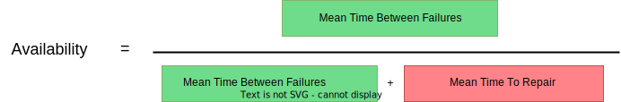
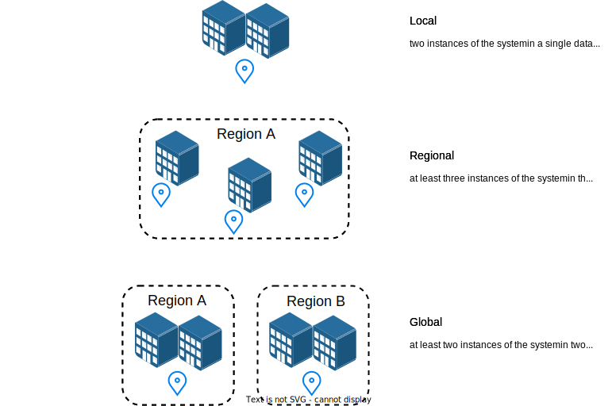

---

copyright:
 years: 2021, 2022
lastupdated: "2022-11-17"

keywords: high availability, ha

subcollection: overview

---

{{site.data.keyword.attribute-definition-list}}

# Considerations for high availability
{: #ha-considerations}

When it comes to [high availability](#x2284708){: term} in the cloud, it is important to understand the high-level concepts that need to be addressed by anyone who is looking to build or run a highly available cloud system.
{: shortdesc}

## Formula for high availability
{: #ha-formula}

One useful definition of availability is MTBF/(MTBF+MTTR), where MTBF is Mean Time Between Failures and MTTR is Mean Time To Repair. Since MTBF is the time when the system is up, and MTTR is the time that the system is down, this can be summarized as Availability = (The time the system is up)/(The time the system is up + The time the system is down).

The reason the formula is useful is that it allows us to see how to improve availability. One can increase MTBF, decrease MTTR, or both. Put another way, this means that availability can be improved by increasing reliability, fixing things when they break more quickly, or both. Both approaches have been used with computer systems over the years. The mainframe, which uses high reliability parts, redundant parts, and modularity to allow quicker repairs, shows that significant levels of availability are possible with this approach.

{: caption="Figure 1. Summarized availability formula" caption-side="bottom"}

## Redundancy in the cloud
{: #redundancy}

In cloud computing, standard reliability parts are used, along with very high levels of redundancy. And, in some ways it is extremely modular in that the replacement unit is usually an entire server. But there is one major difference between the redundancy that is provided in a mainframe and the redundancy that is provided in the cloud – in the cloud the redundancy must be managed by the user. This means that to design a system to run with high availability on the cloud the system designer needs to be familiar with various high availability issues, as well as the design issues associated with the system that they are trying to build.

There are decades of academic and practical writings on high availability, and much of the work requires a good understanding of probability mathematics. However, much like with the formula, many of the principles become obvious when properly explained. Redundancy, which can be complicated in some cases, such as the various levels of RAID disk subsystems, is simply a way of dealing with a widely known principle of system design: “Avoid single points of failure.” Admittedly, while the phrase is simple and obvious, implementation can be tricky.

Rather than go into the complexities of such implementations, we cover a high-level overview of the areas that need to be addressed by anyone looking to build or run a highly available cloud system.

Beyond the general principles of redundancy, fast repair, and single points of failure (SPOFs), probably the most important thing to understand is that improving availability requires spending effort on avoiding likely causes of outages, rather than trying to harden the system against all possible outages.

An example can help to make this clear. In astronomy, it is understood that our solar system will effectively end when the Sun goes nova. This will obviously cause all the computing systems on Earth to fail. Hence it is not something worth spending time and money on avoiding. Perhaps that particular example seems too extreme. So as a much simpler, business-oriented example, consider a city-wide fire, such as the one that burned down much of Chicago in the late 1800s. Fires on that scale are unusual, but not unique. As a business, should you spend time and money making sure that your computer systems could survive such a fire? The answer depends on various factors, but if for instance, your entire customer base is in Chicago, worrying about events that will wipe out the whole city is likely not useful. So it is worth thinking about what sorts of things might fail, how likely they are to happen, and how damaging they would be, before deciding what level of redundancy is appropriate.

### Geographic redundancy
{: #geographic-redundancy}

Levels of redundancy have both a technical and a geographic component. If you have two houses, are you more likely to become homeless if the houses are next door to each other or if they are in different countries? Similar considerations drive computer system redundancy, and are behind {{site.data.keyword.IBM}}’s use of local, regional, and global redundancy. Local redundancy duplicates some or all of a computer system in the same data center. This protects against many kinds of outages, but not all. Regional redundancy, as implemented by {{site.data.keyword.IBM_notm}}, provides at least three copies of the system in three different data centers, so a single local event, like a large fire, is unlikely to take down all the systems. Global redundancy is available for customers that want to avoid outages that are caused by large regional events such as severe hurricanes and typhoons.

{: caption="Figure 2. Local, regional, and global geographic redundancy" caption-side="bottom"}

### Technical redundancy
{: #technical-redundancy}

Most public clouds have standardized geographic redundancy, although the various vendors do it in slightly different ways. But technical redundancy is not provided by the cloud vendors. Instead, they provide the tools for customers to build their own technical redundancy. Rather than go into the myriad complexities around technical redundancy, which is a key area for the technical teams building systems, there are a couple of key things to keep in mind when thinking about technical redundancy.

The first is that higher level of availability typically requires higher levels of replication. Thus, in well-designed systems, those with double, triple, and quadruple redundancy, show improvements in availability as the degree of redundancy goes up. “Well designed” hides a lot of complexity in highly available system design.

The second key aspect of technical redundancy that is worth remembering is that more copies does not automatically mean higher availability. There are two reasons for this. First, if there is a design defect, all your copies are likely to fail in a similar way when faced with similar conditions. In the computer world, design defects are normally called software bugs, and they are not rare. The second reason that more copies do not always lead to higher availability is that you need to know when a copy has broken so you can stop using it. If you don't or can't do that, more copies will actually decrease the apparent availability of the system.

The sorts of problems that arise can be seen with a couple of different examples. The first is the old style of home smoke detector that didn’t have a feature to indicate low battery. Without that feature, the homeowner did not have a way of knowing if the detector would work in the case of a fire. This omission could be worked around, and people would replace the battery once a year whether it needed it or not. The second example is the old style Christmas tree lights with incandescent colored light bulbs with all the lights connected in series (what were known as “single strand” Christmas lights). Since the bulbs were connected in series, if any bulb burned out the entire string would not light up. The fix was to try replacing each light one at a time to see if the string would light up. Note that in both cases the lack of a detection method could be fixed by people driven processes. The same is true with lack of a computerized detection method. Unfortunately such methods do not scale well, but they do exist.

## Redundancy options in {{site.data.keyword.cloud_notm}}
{: #ha-options}

While the preceding discussion of the various aspects of achieving high availability in a cloud environment provides a useful framework for thinking about availability generally, it doesn’t answer one of the key questions for teams looking to create an application to run on the cloud, or even those just looking to run an existing cloud-enabled application on a vendor provided public cloud. That question is what design options are actually available.

While there are numerous technically feasible approaches to redundancy, {{site.data.keyword.IBM_notm}} public cloud has simplified the possible alternatives to a set of four choices, where each choice has both geographic and technical aspects packaged together.

No redundancy
:   {{site.data.keyword.IBM_notm}} allows a customer to lease just enough compute, storage, and network facilities to run a single instance of their system. This is the lowest cost option, available at data centers around the world, and comes with an availability target of 99.9% uptime, not including planned outages.

Local redundancy
:   This next level up provides two instances of the system in a single data center. Target uptime for local redundancy is 99.95% uptime, not including planned outages.

Regional redundancy
:   This third level up uses an {{site.data.keyword.IBM_notm}} multizone region (MZR) to provide connections from two independent power vendors, redundant connections to two different network PoPs, and three independent data centers that are spread across a metro area where the customer can lease facilities for three instances of their system, with a target uptime of 99.99% availability, with no exclusions for planned outages.

Global redundancy
:   For customers who want a global presence or the highest levels of availability, {{site.data.keyword.IBM_notm}} public cloud offers global redundancy, using two (or more commonly three) MZRs in different geographies, with a target uptime of 99.995% uptime, and no exclusions for planed outages. {{site.data.keyword.IBM_notm}} public cloud customers seem to find this range of options allow them to match their business needs to their desired availability in an effective way.
