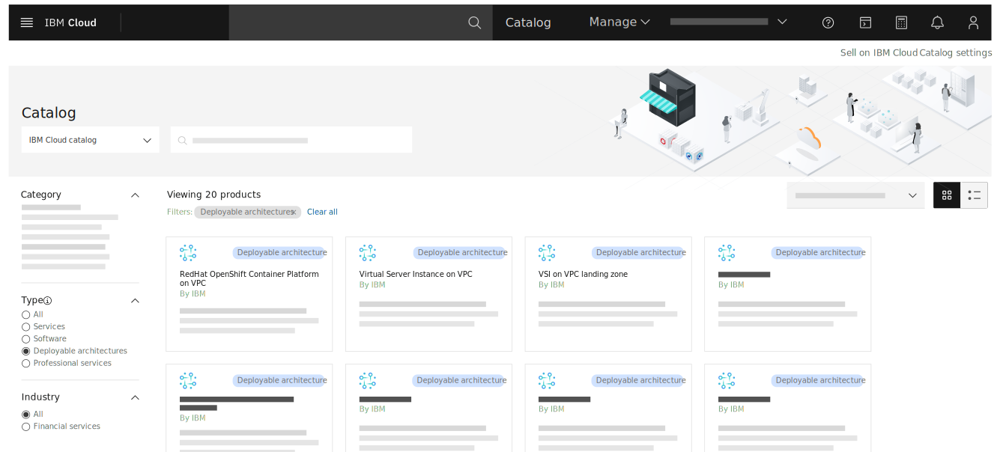
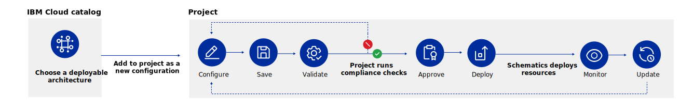
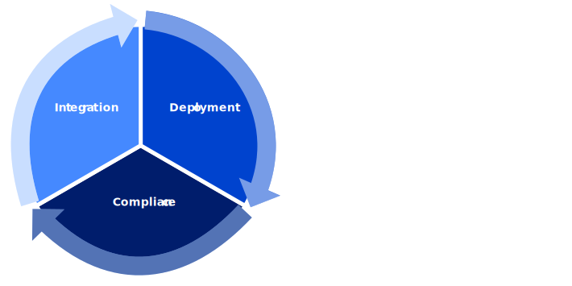

---

copyright:
  years: 2023
lastupdated: "2023-06-14"

keywords:

subcollection: overview

---

{{site.data.keyword.attribute-definition-list}}

# Running secure enterprise workloads on {{site.data.keyword.cloud_notm}}
{: #secure-enterprise}

With continuous compliance at the core of {{site.data.keyword.cloud}}'s platform, your team has all of the tools at your disposal to securely develop, deploy, and manage your regulated, mission-critical enterprise workloads in the cloud.
{: shortdesc}

For highly regulated industries, such as financial services, achieving continuous compliance within a cloud environment is an important first step toward protecting customer and application data. Historically, that process has been difficult and manual, which placed your organization at risk. But, with {{site.data.keyword.cloud_notm}} you can work with predefined deployable architectures, automate infrastructure-as-code deployments with [projects](#x2035151){: term}, and integrate automatic security checks into every day workflows to minimize risk.

With {{site.data.keyword.cloud_notm}}, your whole team from solution architects, compliance managers, infrastructure DevOps teams, to application development teams can use a shift-left approach to identify security risks and exposures early when developing and deploying cloud solutions. This keeps security and compliance at the center of your workflow and organizational culture so that your enterprise can operate in the cloud with confidence. Check out the following video to learn more about how {{site.data.keyword.cloud_notm}} can help you accelerate and maintain your regulated standards at scale.

{: video output="iframe" data-script="#enterprise-video-transcript" id="youtubeplayer" frameborder="0" webkitallowfullscreen mozallowfullscreen allowfullscreen}

## Video transcript
{: #enterprise-video-transcript}
{: notoc}

Hi, I’m Mark Meredith a product manager for IBM Cloud.

As a large enterprise your requirements for scale, security, infrastructure, and governance all influence your move to the cloud.

With the tools available through IBM Cloud, you can start and stay compliant, use automation, and ensure deployments are done by using a secure software supply chain, all while managing your resources at scale.

Creating secure, compliant, robust, and scalable application infrastructure can be difficult to set up and costly to maintain.

But, if you standardize application infrastructure where possible and then host many applications on the same infrastructure you can reduce operations costs.

You can do this with deployable architectures and projects on IBM Cloud.

With our growing catalog of deployable architectures you can quickly get started by adding it to a project and customizing it to your needs.

Projects aren’t just for configuring your solution though. Projects also enable you to organize resources by what you care about in your organization, whether it’s by application or business unit, to get helpful views into cost, availability, and compliance.

Projects have built in governance ensuring that only validated, compliant, and approved code is deployed.

Achieving continuous security and compliance for your regulated workloads is key to your business and ours. With IBM Cloud Security and Compliance Center, you can integrate daily, automatic compliance checks into your development lifecycle to help minimize risk and be audit-ready.

From automating the creation of accounts to authorizing only IBM Cloud projects to deploy resources from approved, compliant deployable architectures, your enterprise can shift left and reduce the possibility of human error that can lead to major security or financial risks.

Visit the IBM Cloud catalog to check out the secure by default deployable architectures that you can add to a project to get started today.

## Defining your compliance strategy
{: #define-enterprise-compliance}

By planning and defining your enterprise's goals for running secure workloads on {{site.data.keyword.cloud_notm}} early in the process, you can reduce the time to production for building infrastructure and applications in the cloud. With {{site.data.keyword.cloud_notm}}, you can save your business time and money by taking advantage of our automation and standardized best practices as you work. Get started by reviewing our predefined, compliant architectures and control libraries to see how your industry fits in the cloud.

### Understanding security and compliance requirements
{: #security-compliance-requirements}

While you're working through the planning phase of running your enterprise solutions on {{site.data.keyword.cloud_notm}}, it's important to consider the internal and external standards that your organization must meet. For example, if you are a medical establishment, you most likely need to prove that you are upholding HIPAA requirements. Or, if you are a financial institution you might need to prove that you are meeting NIST standards. With [{{site.data.keyword.compliance_full}}](/docs/security-compliance?topic=security-compliance-getting-started), you can take advantage of predefined control libaries that are designed to help you validate and prove compliance for a group of controls.

### Identifying the right infrastructure architecture
{: #define-architecture}

Instead of figuring out how to assemble a compliant infrastructure architecture on your own, you can review the deployable architectures that are available in [the catalog](/catalog#reference_architecture). {{site.data.keyword.cloud_notm}} provides automation for the deployment of common architectural patterns that combine one or more cloud resources, which are known as deployable architectures. Each [deployable architecture](#x10293733){: term} is built and maintained by {{site.data.keyword.cloud_notm}} experts following {{site.data.keyword.cloud_notm}} best practices to take the guesswork out of the architecture design process and reduce the time that it takes to deploy to just minutes. Compliance managers and solution architects can review the components of the architecture and the level of compliance that each deployable architecture meets by reviewing the details directly from the catalog detail pages.

{: caption="Figure 1. IBM Cloud catalog showing deployable architecture tiles" caption-side="bottom"}

If you work in a financial institution, you might want to work with {{site.data.keyword.framework-fs_full}} validated products. The framework is designed to build trust and enable a transparent public cloud ecosystem with a focus on the specific features for security, compliance, and resiliency that finanicial institutions require. For more information about the {{site.data.keyword.framework-fs_notm}}, see [Getting started with {{site.data.keyword.framework-fs_notm}}](/docs/framework-financial-services?topic=framework-financial-services-about). To get started, you can filter the catalog to view only those products that have been Financial Services Validated. And, even if you're not in the financial industry, you can be assured that these products meet stringent industry regulations for sensitive data and complex workloads.

## Configuring and deploying compliant architectures and applications
{: #deploy-compliant-arch}

When your team has evaluated and chosen a deployable architecture, development engineers can use a [project](/docs/secure-enterprise?topic=secure-enterprise-understanding-projects#project-benefits) to configure it to fit your enterprise's business needs.

A project is a named collection of configurations that are used to manage related resources and Infrastructure as code (IaC) deployments across accounts. They enable your teams to focus on a shift-left approach by using DevOps best practices to configure, deploy, and monitor deployments. Each project includes tools that scan for potentially harmful resource changes, compliance, security, and cost, as well as tracking versioning and governance. They're designed with an IaC and compliance-first approach that helps to ensure that a project is managed, secure, and always compliant.

{: caption="Figure 2. Understanding the projects workflow." caption-side="bottom"}

You can [customize and extend an {{site.data.keyword.cloud_notm}} deployable architecture](/docs/secure-enterprise?topic=secure-enterprise-customize-from-catalog) to ensure that the architecture meets your needs. Then, you can leverage private catalogs in your account to make your custom deployable architecture available for only members of your enterprise. After onboarding a customized deployable architecture to your private catalog, users that have access to the private catalog can then configure and deploy it from a project.

### Securing your software supply chain
{: #secure-supply-chain}

Your team can take advantage of cost-effective software delivery and proactive security practices with {{site.data.keyword.cloud_notm}} DevSecOps. The [DevSecOps Application Lifecycle Management deployable architecture](/docs/devsecops-alm?topic=devsecops-alm-devsecops-alm-overview) provides a streamlined way to set up continuous integration (CI), continuous development (CD), and continuous compliance (CC) toolchains for secure and agile application development.

By using the DevSecOps Application Lifecycle Management deployable architecture to set up the framework to manage the lifecycle of your application code, you can put security and compliance at the forefront of your development lifecycle and set your team up to implement an automated, shift-left approach to development.

{: caption="Figure 3. Continuous integration, deployment, and compliance" caption-side="bottom"}

The [CI toolchain](/docs/devsecops?topic=devsecops-cd-devsecops-ci-pipeline) provides pipelines that scan your code and build artifacts, catch security issues early, and prevent those issues from being introduced into the product configuration, while collecting evidence that can be used for audits. The [CD toolchain](/docs/devsecops?topic=devsecops-cd-devsecops-cd-pipeline) checks for required evidence, generates a change request document with an evidence summary and description of changes, and gates deployment based on compliance with your organization’s security policies. And, because new vulnerabilities that were not previously known might always be discovered, you can leverage the [CC toolchain](/docs/devsecops?topic=devsecops-devsecops-cc-pipeline) to continuously assess app security and compliance posture for code that is already in production.

To learn more, see the [DevSecOps documentation](/docs/devsecops?topic=devsecops-devsecops_intro).

## Assessing and maintaining compliance of enterprise workloads
{: #assess-compliance}

Although {{site.data.keyword.cloud_notm}} reduces the time and complexity of setting up a compliant enterprise application, you still need to ensure that you're maintaining compliance. To do so, you can use the {{site.data.keyword.compliance_short}} to run [automatic evaluations](/docs/security-compliance?topic=security-compliance-scan-resources) on your resource configurations. The evaluation results are provided in the dashboard of the {{site.data.keyword.compliance_short}} or you can get notified of changes. You are able to quickly assess the risk to your organization, fix issues, and generate reports so that you're always audit-ready.

{: caption="Figure 4. Example Security and Compliance Center dashboard" caption-side="bottom"}

Also, using DevSecOps CI/CD/CC toolchains can help to automate the evaluation of controls as part of the development process and can block noncompliant changes from being promoted. Managing your application code this way ensures that you have the evidence and change history that is needed to meet the required compliance standards for your industry. For more information about a shift-left approach to deploying your code, see [DevSecOps architecture](/docs/devsecops?topic=devsecops-cd-devsecops-arch).

## Get started with your enterprise workloads on {{site.data.keyword.cloud_notm}}
{: #enterprise-get-started}

With the tools available through {{site.data.keyword.cloud_notm}}, you can start and stay compliant with automation and ensure that deployments are done by using a secure software supply chain, all while managing your resources at scale. Go to the [{{site.data.keyword.cloud_notm}} catalog](/catalog) to check out the deployable architectures and visit the [{{site.data.keyword.compliance_short}}](/security-compliance/overview) today to start defining your goals for security and compliance.

For more information about setting up your enterprise, configuring automated deployments by using projects, customizing deployable architectures, and more, see the [Enterprise account architecture](/docs/enterprise-account-architecture) white paper and [Running secure enterprise workloads](/docs/secure-enterprise) documentation.
